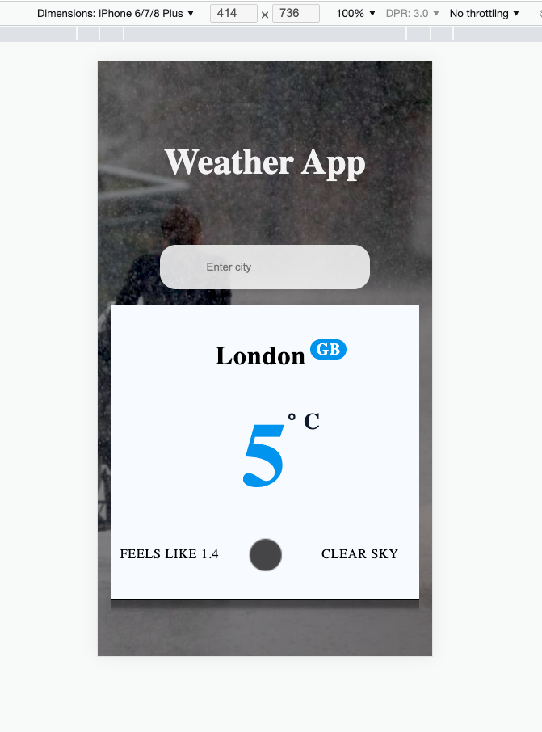

[](https://standardjs.com)


<h2 align="center">PWA Weather application</h2>

<br />

A **PWA** weather application that takes an input (`type:string cityName`) entered by a user, and returns its weather information.   
Progressive web apps bring native-like features into a web application, and work regardless of network connectivity.


## Installation 

```js
Build with Create React App
```

- Clone application 
- Install dependencies and
- Type `npm start`


### Data

- OpenWeather API


<br />

<kbd>Screenshot</kbd>


