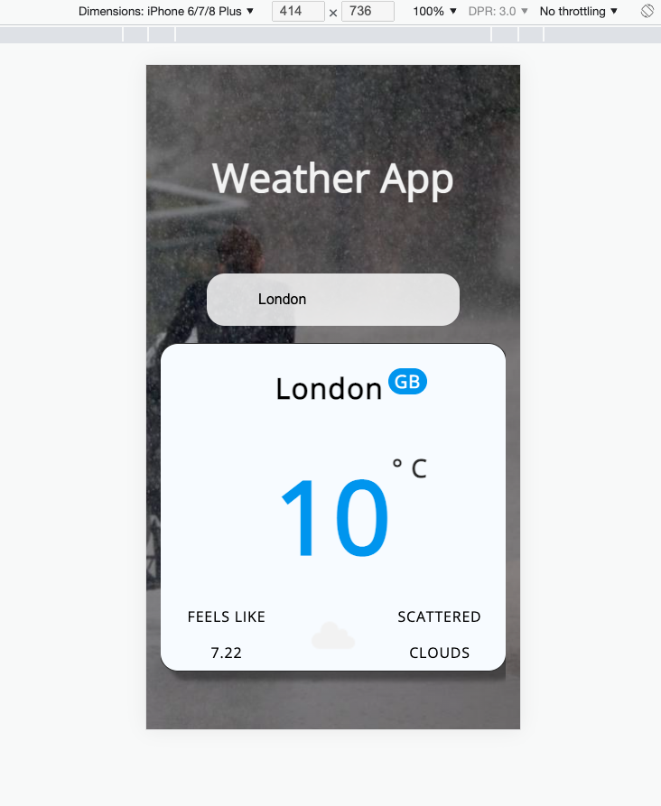
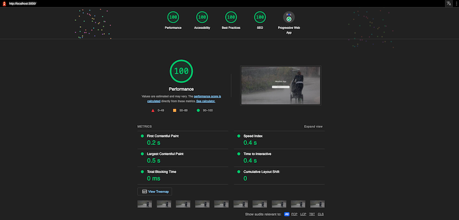
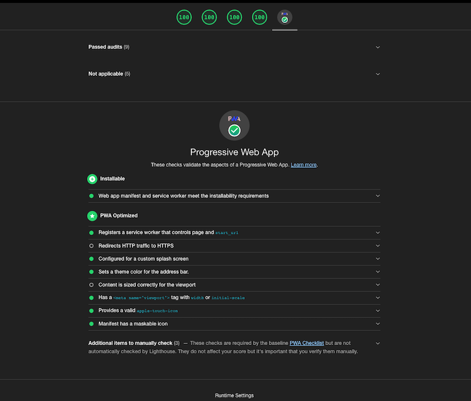
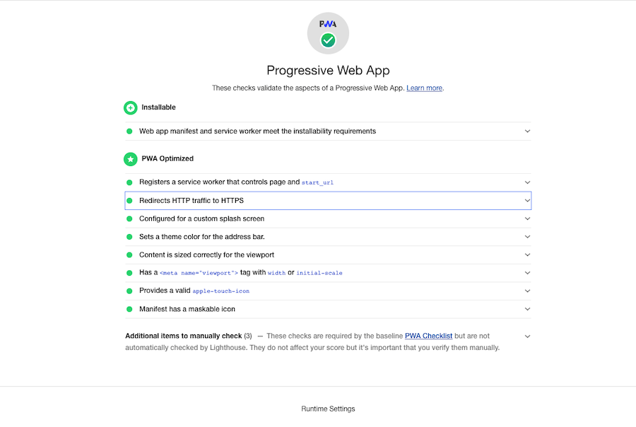
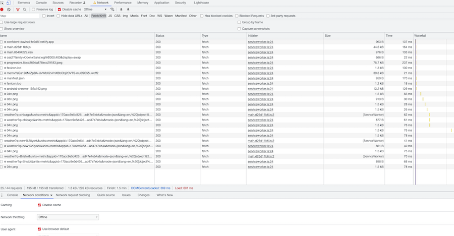
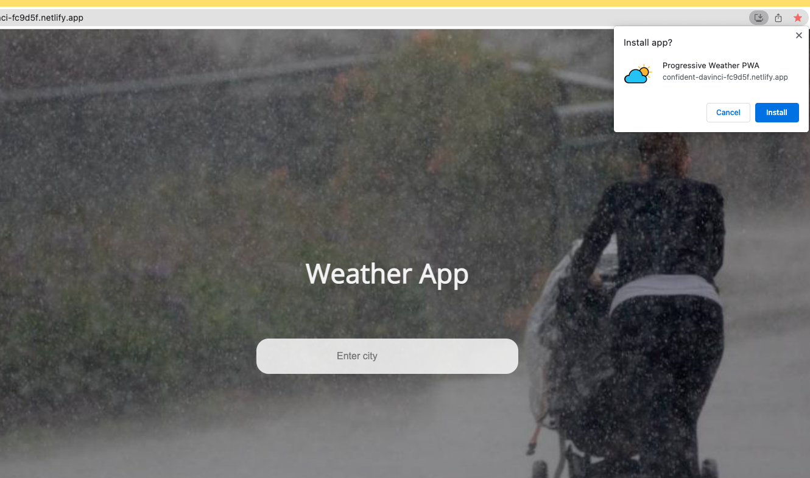

[](https://app.netlify.com/sites/musing-fermat-d1e3d9/deploys) &nbsp; [](https://deepscan.io/dashboard#view=project&tid=16862&pid=20304&bid=549826) &nbsp; [](https:/github.com/stefan22/progressive-weather-app.git) &nbsp;  &nbsp; [](https://badge.fury.io/js/react)

<br />

<h2 align="center">Building PWA apps &nbsp; 🅿️  🍺</h2>


<br />


A **PWA** React Weather Application, that takes an input (`type:string cityName`) entered by user, and returns its weather information.   
Progressive web apps bring native-like features into a web application, and work regardless of network connectivity.


## Installation 🥯

```js
Build with Create React App
```

- Clone application 
- Install dependencies and
- Type `npm start`


<br />

<h2>Live link</h2>

App deployed to Netlify: ➡️ [PWA-Weather_app](https://musing-fermat-d1e3d9.netlify.app)

  
<br />

### Data

- OpenWeather API


<br />

<kbd>Screenshot</kbd>





<br />

----------------------------------------------------------------


<kbd>Lighthouse</kbd>




<br />




-----------------------------


<br />

<kbd>Deployed to Netlify - Redirects to HTTPS</kbd>



<br />

<kbd>Offline & Service Worker</kbd>




<br />

<kbd>Install App in local machine</kbd>


